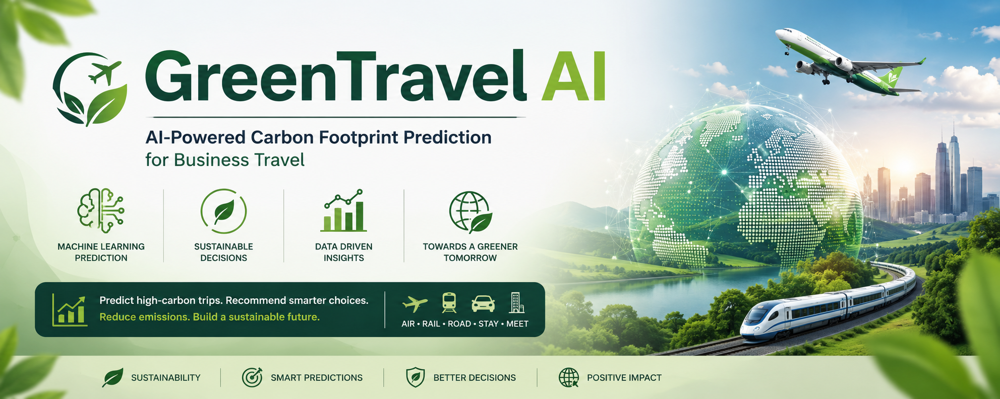

<p align="center">
    
</p>

# 🌿 GreenTravel AI
## AI-Powered Carbon Footprint Prediction & Sustainability Analytics Platform

> **Predict high-carbon business trips before booking and empower organizations to make smarter, more sustainable travel decisions.**


---

# 🌍 Live Application

### 🔗 https://green-travelai.up.railway.app

---

# 📌 Problem Statement

Business travel accounts for a significant share of corporate carbon emissions.

According to the Global Business Travel Association (GBTA), air travel alone contributes roughly **2–3% of global CO₂ emissions**, while a single long-haul business-class flight can emit **over 2,000 kg of CO₂e per passenger**—comparable to the emissions produced by driving a typical passenger car for several months.

As organizations pursue ambitious sustainability goals and net-zero commitments, business travel remains one of the most challenging operational areas to decarbonize. Travel decisions are influenced by urgency, cost, convenience, company policies, and employee requirements.

This project explores how **Artificial Intelligence and Machine Learning** can help identify potentially high-carbon trips **before they are booked**, enabling organizations to make more informed and environmentally responsible travel decisions.

---

# 🎯 Project Objective

GreenTravel AI aims to assist organizations in reducing unnecessary travel emissions by predicting whether a planned business trip is likely to have a **High** or **Low Carbon Footprint**.

Rather than calculating exact CO₂ emissions, the application performs **risk classification**, identifies important contributing factors, and provides practical sustainability recommendations.

The project aligns with global sustainability initiatives and demonstrates how AI can support data-driven environmental decision-making.

---

# 📊 Dataset

The machine learning model was developed using approximately **65,000 business travel records** containing real-world travel information.

The dataset contains **20 engineered and business-related features**, including:

- Departure Country
- Departure City
- Arrival Country
- Arrival City
- Transportation Mode
- Transportation Description
- Business Unit
- Purpose of Travel
- Company Entity
- Hotel Nights
- Net Travel Cost
- Trip Type
- Route
- Cost per Night
- Event Count
- Out-of-Policy Indicator

These features collectively represent multiple aspects of business travel behavior and provide rich information for predictive modeling.

---

# 🤖 Machine Learning Pipeline

The project follows a complete end-to-end machine learning workflow.

```
Business Travel Data
        │
        ▼
Data Cleaning
        │
        ▼
Feature Engineering
        │
        ▼
Handling Missing Values
        │
        ▼
Categorical Encoding
        │
        ▼
Preprocessing Pipeline
        │
        ▼
XGBoost Classification Model
        │
        ▼
Prediction
        │
        ▼
Risk Score Generation
        │
        ▼
AI-Based Sustainability Recommendations
```

---

# 🔬 Data Analysis & Feature Engineering

Extensive preprocessing and feature engineering were performed before model training.

### Data Preparation

- Missing value handling
- Duplicate removal
- Data validation
- Feature transformation

### Engineered Features

- Route Generation
- Trip Type Identification
- Cost Per Night
- Event Count
- Business Unit Encoding
- Transportation Category Mapping

### Machine Learning Techniques

- Pipeline-based preprocessing
- Numerical feature scaling
- Categorical feature encoding
- XGBoost Classification
- Probability-based prediction

---

# 🌱 Key Features

✅ Carbon Risk Prediction

✅ Probability-based Carbon Risk Score

✅ Explainable Prediction Output

✅ Sustainability Recommendations

✅ Business Travel Analytics

✅ Interactive Dashboard

✅ Responsive Web Interface

✅ End-to-End Machine Learning Deployment

---

# 💻 Technology Stack

## Artificial Intelligence & Machine Learning

- Python
- Scikit-Learn
- XGBoost
- Pandas
- NumPy
- Joblib

## Backend

- Flask

## Frontend

- HTML5
- CSS3
- JavaScript

## Deployment

- Railway
- GitHub

---

# 📈 Web Application Workflow

```
User Input
      │
      ▼
Flask Backend
      │
      ▼
Preprocessing Pipeline
      │
      ▼
Trained ML Model
      │
      ▼
Prediction Probability
      │
      ▼
Carbon Risk Classification
      │
      ▼
Recommendations & Insights
```

# 📂 Project Structure

```
GreenTravel-AI

│
├── app.py
├── model.pkl
├── requirements.txt
├── runtime.txt
├── Procfile
│
├── static
│   ├── style.css
│   └── script.js
│
├── templates
│   ├── index.html
│   ├── result.html
│   ├── dashboard.html
│   └── about.html
│
└── README.md
```

---

# 🚀 Installation

Clone the repository

```bash
git clone https://github.com/shDushyant/GreenTravel-AI.git
```

Move into the project

```bash
cd GreenTravel-AI
```

Install dependencies

```bash
pip install -r requirements.txt
```

Run the application

```bash
python app.py
```

Open

```
http://127.0.0.1:5000
```

---

# 🌍 Real-World Applications

This project demonstrates how AI can assist organizations in:

- Sustainable Business Travel Planning
- ESG Reporting Support
- Corporate Carbon Reduction Initiatives
- Travel Policy Optimization
- Environmental Risk Assessment
- Responsible Decision Support

---

# 📌 Future Scope

- Live Carbon Emission Estimation APIs
- Flight & Train Route Optimization
- Interactive Geographic Maps
- PDF Sustainability Reports
- User Authentication
- Organizational Analytics Dashboard
- Carbon Offset Suggestions
- LLM-powered Travel Assistant

---

# 💼 Skills Demonstrated

### Machine Learning

- Predictive Modeling
- Classification
- Feature Engineering
- Data Preprocessing
- Model Deployment

### Data Analytics

- Exploratory Data Analysis
- Business Data Understanding
- Feature Construction
- Data Cleaning

### Software Engineering

- Flask Development
- REST-style Application Design
- Frontend Integration
- Cloud Deployment
- Git & GitHub

---

# 👨‍💻 Author

**Dushyant Sharma**

AI Engineering • Machine Learning • Full Stack Development

### Live Demo

https://green-travelai.up.railway.app

### GitHub

https://github.com/shDushyant/GreenTravel-AI

---

## ⭐ If you found this project interesting, consider giving it a Star!
